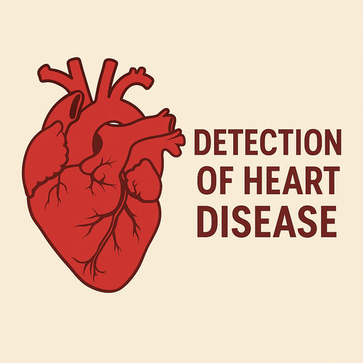

# Обнаружение сердечных заболеваний с использованием линейной модели

[](https://www.python.org/downloads/)
[](https://opensource.org/licenses/MIT)
[](https://github.com/psf/black)

Проект машинного обучения для предсказания сердечных заболеваний с использованием линейных моделей.

## 📋 О проекте



В этом проекте используются методы машинного обучения для классификации пациентов по признаку наличия или отсутствия сердечного заболевания. Проект основан на линейных моделях, таких как логистическая регрессия.  
[**Ссылка на датасет с Kaggle**](https://www.kaggle.com/datasets/fedesoriano/heart-failure-prediction)

## 🚀 Быстрый старт

### Предварительные требования

- Python 3.8 или выше
- pip (менеджер пакетов Python)

### Установка

1. Клонируйте репозиторий:
```bash
git clone https://github.com/your-username/heart-disease-detection.git
cd heart-disease-detection
```

## **Посмотреть моё решение**

- [Посмотреть IPython Notebook](https://github.com/yarmukh/Heart-Failure-Prediction/blob/main/notebook.ipynb)

## 📊 **О датасете**

### Контекст задачи
Сердечно-сосудистые заболевания являются ведущей причиной смерти во всем мире, унося около **19,8 миллиона жизней ежегодно** (~32% всех смертей). **Восемьдесят пять процентов** этих случаев вызваны **инфарктами и инсультами**, при этом **треть приходится на людей моложе 70 лет**. **Сердечная недостаточность**, от которой страдают более **64 миллионов человек**, является распространённым последствием этих заболеваний. Среди ключевых факторов риска выделяется **гипертония**, которой страдают около **26% взрослых** и которая предшествует сердечной недостаточности в **90% случаев**. Хронические болезни, включая сердечно-сосудистые, составляют **75% всех смертей**, и сердечно-сосудистые заболевания остаются «тихим убийцей», унося каждую **третью жизнь** в мире.

### **Описание датасета**

**Размер датасета:** 918 наблюдений

**Источники данных:**
Датасет был составлен путём объединения 5 разных наборов данных:

 - Cleveland: 303 наблюдения
 - Hungarian: 294 наблюдения
 - Switzerland: 123 наблюдения
 - Long Beach VA: 200 наблюдений
 - Stalog (Heart) Data Set: 270 наблюдений

**Общий исходный объём:** 1190 наблюдений  
**Удалено дубликатов:** 272 наблюдения  
**Итоговый объём:** 918 наблюдений  

### Атрибуты данных

| Признак            | Описание                                                                                                                                                                                             | Тип данных        |
| ------------------ | --------------------------------------------------------------------------------------------------------------------------------------------------------------------------------------------------- | ---------------- |
| **Age**            | Возраст пациента                                                                                                                                                                                     | годы             |
| **Sex**            | Пол пациента [M: Мужской, F: Женский]                                                                                                                                                               | категориальный   |
| **ChestPainType**  | Тип боли в груди [TA: Типичная стенокардия, ATA: Атипичная стенокардия, NAP: Боль не связана со стенокардией, ASY: Бессимптомный]                                                                   | категориальный   |
| **RestingBP**      | Артериальное давление в состоянии покоя                                                                                                                                                              | мм рт. ст.       |
| **Cholesterol**    | Уровень холестерина в сыворотке крови                                                                                                                                                                | мг/дл            |
| **FastingBS**      | Уровень сахара натощак [1: если > 120 мг/дл, 0: иначе]                                                                                                                                               | бинарный         |
| **RestingECG**     | Результаты ЭКГ в покое [Normal: Норма, ST: аномалия волны ST-T (инверсии T и/или подъём или депрессия ST > 0.05 мВ), LVH: гипертрофия левого желудочка по критериям Эстеса]                         | категориальный   |
| **MaxHR**          | Максимальная достигнутая частота сердечных сокращений                                                                                                                                                | числовой (60–202)|
| **ExerciseAngina** | Стенокардия, вызванная нагрузкой [Y: Да, N: Нет]                                                                                                                                                      | бинарный         |
| **Oldpeak**        | Oldpeak = ST (величина депрессии сегмента ST)                                                                                                                                                        | числовой         |
| **ST_Slope**       | Наклон сегмента ST при нагрузке [Up: восходящий, Flat: горизонтальный, Down: нисходящий]                                                                                                             | категориальный   |
| **HeartDisease**   | Целевая переменная [1: заболевание сердца, 0: норма]                                                                                                                                                | бинарный         |

### **Создатели датасета:**

- Венгерский институт кардиологии, Будапешт: д-р Андраш Яноши
- Университетская клиника Цюриха, Швейцария: д-р Вильям Штайнбрунн
- Университетская клиника Базеля, Швейцария: д-р Маттиас Пфистерер
- Медицинский центр для ветеранов, Лонг-Бич и Клиника Кливленда: д-р Роберт Детрано

Даритель данных: Дэвид В. Аха (Калифорнийский университет, Ирвайн)
